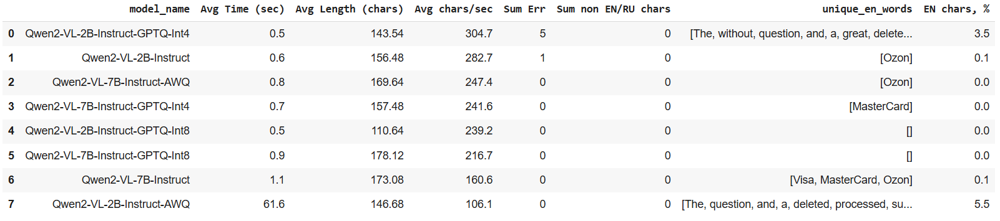
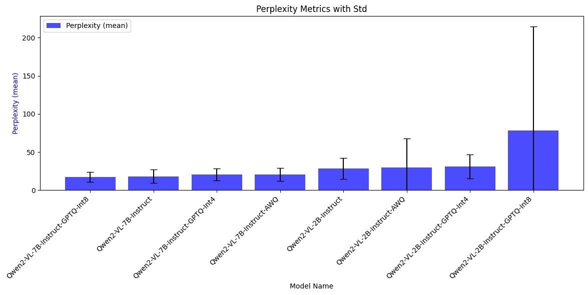
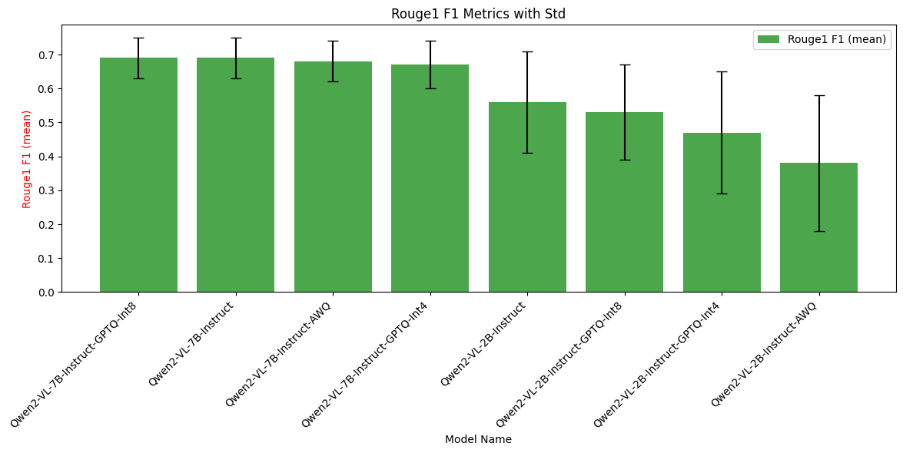
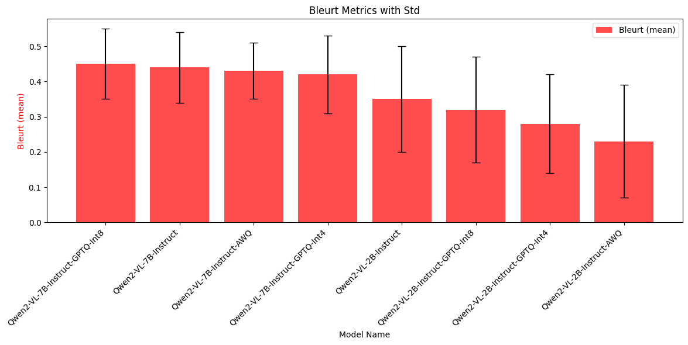
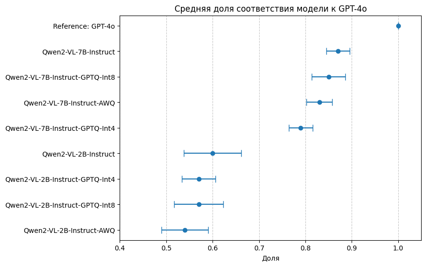
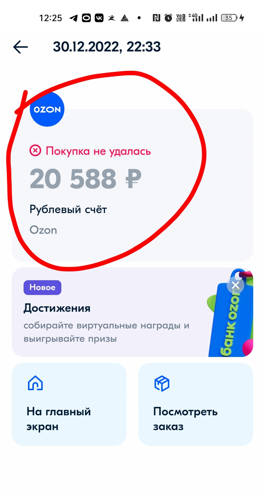
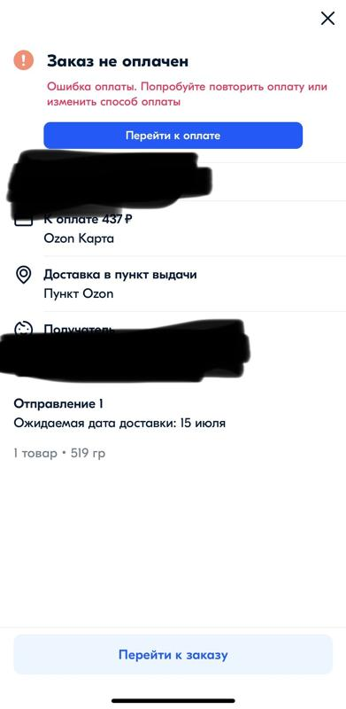
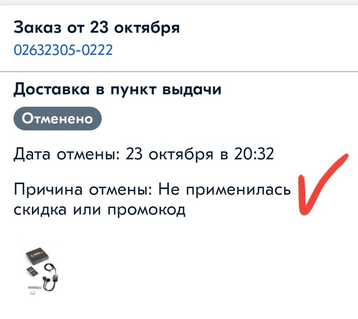

# VLM_eval_pipeline

Проект направлен на улучшение автоматизации технической поддержки путем использования Visual Language Models (VLM) для обработки скриншотов, прикрепляемых к обращениям пользователей. Основная идея заключается в преобразовании визуальной информации из скриншотов в текстовое описание — запрос пользователя, который может быть использован существующими моделями классификации интентов и/или генеративными моделями автоматических ответов на пользовательский запрос.

**В этом репозитории представлен пайплайн для тестирования VLM моделей.**

**Целью тестирования является оценка качества работы различных визуально-лингвистических моделей в контексте задач автоматизации технической поддержки.**

Задачами тестирования является:

* Оценка точности генерации текстовых описаний: проверяется, насколько корректно, точно и детализированно модели преобразуют визуальную информацию из скриншотов в текст.
* Сравнение производительности моделей: проводится анализ времени генерации, использования ресурсов и стабильности выходных данных между различными моделями, чтобы определить наиболее оптимальную для production-среды.
* Оценка стабильности и интерпретируемости результатов: анализируется консистентность ответов моделей при одинаковых входных данных, их полезность и релевантность.

Эти задачи помогут определить, какие модели способны лучше справляться с преобразованием визуальной информации в текст, а также выбрать наиболее производительное решение для внедрения в систему технической поддержки.

## Сценарий тестирования

* В тестируемую модель подается одна системная промт-инструкция и ссылка на скриншот.
* Сообщение от пользователя в пайплайне тестирования не используется.
* Температура тест-моделей: 0.1.
* Всего совершается 5 запусков генерации для 10 скриншотов, что составляет 50 генераций на одну модель.

## Метрики, статистики и оценки

### Технические статистики

* Общее время генерации (сек.)
* Средняя длина ответа (знаки)
* Скорость генерации — кол-во знаков в секунду
* Количество грамматических ошибок
* Количество некириллических и не англоязычных символов
* Доля англоязычных символов

### Автоматические метрики

* **Перплексия** — насколько хорошо модель предсказывает последовательности слов (чем ниже, тем лучше).
* **ROUGE-1** — оценка качества машинной генерации текста путём сравнения с эталонным текстом. Сравнение производится по отдельным словам (униграммам).
* **BLEURT** — метрика, основанная на предобученных трансформерах, которая оценивает качество текста по его смысловому сходству с эталонным текстом. BLEURT учитывает синонимы и парафразы, лексическую и семантическую близость, относительную важность различных слов. 0 означает случайный результат, а 1 - идеальный.

### Субъективная (судейская) оценка

* На основе промпта для LLM судья ставит оценки по десятибалльной шкале и подробно объясняет свою оценку.
* Учитывается анонимность ответов. Судья не знает и не учитывает, от какой модели приходит ответ.
* Ответы рандомно меняются местами, чтобы избежать смещения в пользу какой-то одной модели (*position bias* — склонность модели первый ответ оценивать выше).
* В качестве эталонной модели (референс) выступает gpt-4o
* В качестве модели-судьи (LLM-as-a-Judge) выступает gpt-4o-mini
* Оценивается доля соответствия ответов тестируемой модели к ответам эталонной модели, где доля соответствия — отношение судейских оценок: *Candidate Score/Reference Score*.
* Границами оценки является 95%-й доверительный интервал.

## Список тест-моделей и потребление памяти

**7B МОДЕЛИ:**

|         Model        | Input Length | Quantization | GPU Memory (GB) |
| -------------------- | ------------ | ------------ | --------------- |
| Qwen2-VL-7B-Instruct | 1 — 6144 tok | BF16         | 16.07 — 21.56   |
|                      |              | GPTQ-Int8    | 10.11 — 15.61   |
|                      |              | GPTQ-Int4    | 7.20 — 12.69    |
|                      |              | AWQ          | 7.07 —  12.56   |

**2B МОДЕЛИ:**

| Model                | Input Length | Quantization | GPU Memory (GB) |
| -------------------- | ------------ | ------------ | --------------- |
| Qwen2-VL-2B-Instruct | 1 — 6144 tok | BF16         | 4.68 — 10.01    |
|                      |              | GPTQ-Int8    | 3.55 — 8.87     |
|                      |              | GPTQ-Int4    | 2.91 — 8.21     |
|                      |              | AWQ          | 2.88 — 8.18     |

## Model Inference

Тест-модель разворачивается с помощью фреймворка vLLM раз как сервер, реализующий протокол OpenAI API. По умолчанию сервер запускается по адресу http://localhost:8000.

Сервер использует предопределенный [шаблон чата](https://github.com/vllm-project/vllm/blob/main/docs/source/serving/openai_compatible_server.md#chat-template), хранящийся в токенизаторе.

К этому серверу можно обращаться в том же формате, что и к OpenAI API. Например, чтобы получить список моделей: curl http://localhost:8000/v1/models

## Структура директорий

```shell
VLM_eval_pipeline/
├── artifacts/                   # Артефакты скриншотов результатов тестирования.
│
├── eval/                        # Модули для оценки моделей.
│   ├── autometrics_eval.py      # Методы для оценки автоматических метрик (BLEURT, ROUGE).
│   ├── judge_eval.py            # Класс для оценки с использованием LLM-судьи.
│   ├── reference_eval.py        # Класс для генерации эталонных ответов.
│   ├── tech_metrics_eval.py     # Подсчёт технических характеристик.
│   └── test_eval.py             # Класс для генерации ответов тест-моделей.
│
├── open_test_dataset/           # Набор тестовых данных (скриншоты).
│
├── test_results/                # Результаты тестирования.
│   ├── auto_metrics_stats.xlsx  # Оценки автоматических метрик (BLEURT, ROUGE).
│   ├── judgement_scores.xlsx    # Судейские оценки, полученные от LLM.
│   └── summary_test_stats.xlsx  # Сводные результаты от тест-моделей и тех. статистики.
│
├── Test_pipeline.ipynb          # Jupyter Notebook с запуском тестового пайплайна.
├── README.md                    # Основная документация проекта.
├── requirements.txt             # Список зависимостей для установки.
```

## Результаты экспериментов

Ниже приведены результаты сравнения тестируемых моделей с ответами эталона — gpt-4o.

**Результаты технических статистик:**


*Столбцы: название модели, среднее время генерации (сек.), средняя длина текста (знак.), средняя скорость генерации (знак./сек.), Σ орф. ошибок, Σ не ru/en символов (пр. языки), уникальные английские слова в генерации, доля знаков на английском яз.*

* Большинство моделей демонстрируют приемлемое время генерации (от 0.5 до 1.1 секунд), за исключением Qwen2-VL-2B-Instruct-AWQ, которая имеет значительно более высокое время (61.6 секунд) из за фризов генерации.
* У большинства моделей отсутствуют грамматические ошибки, за исключением Qwen2-VL-2B-Instruct-GPTQ-Int4 (5 ошибок) и Qwen2-VL-2B-Instruct (1 ошибка).
* Модели Qwen2-VL-2B-Instruct-GPTQ-Int4 и Qwen2-VL-2B-Instruct-AWQ периодически уходят в генерацию на английском языке, что делает их непрактичным выбором для production.
* Квантованные 7B модели имеют сопоставимую с 2B моделями скорость генерации. Благодаря этому модели Qwen2-VL-7B квантованных версий (Int4, Int8, AWQ) обеспечивают лучшее соотношение скорости и качества.
* Qwen2-VL-7B-Instruct (без квантования) на 25-35% медленнее своих квантованных 7B версий.

**Результаты оценки автоматическими метриками:**





* В общем случае, модели серии Qwen2-VL-7B имеют более низкую перплексию, и более высокие значения метрик Rouge1 F1 и Bleurt, по сравнению с Qwen2-VL-2B, что указывает на их более высокую способность к генерации текстовых последовательностей и высокую семантическую близость ответов к эталонному описанию.
* Квантованные версии (Int8, Int4, AWQ) моделей, показывают схожие значения метрик в пределах своих серий (2B или 7B).

**Результаты оценки судьи gpt-4o-mini (LLM-as-a-judge):**



* Модели серии Qwen2-VL-7B показывают более высокую долю соответствия с эталоном, чем Qwen2-VL-2B, что указывает на их лучшие качества генерации текста.
* Наибольшее соответствие с эталоном имеет модель Qwen2-VL-7B-Instruct (0.87) и её квантованные версии: GPTQ-Int8 (0.85), AWQ (0.83), и GPTQ-Int4 с долей 0.79.
* Все модели серии Qwen2-VL-2B имеют значительно меньшую долю соответствия (около 0.5–0.6), что указывает на их ограниченные возможности в задачах генерации.

## Рекомендации

* Квантованные Qwen2-VL-7 модели имеют хорошую скорость генерации, показывают более качественные и стабильные результаты.
* Для задач, требующих максимального качества генерации следует выбирать Qwen2-VL-7B, включая квантованные версии (Int8, Int4, AWQ).
* Квантование малых Qwen2-VL-2B моделей ведет к проблемам генерации (фризы, ошибки, смена языка), малую семантическую близость к эталону.
* Модели Qwen2-VL-2B подходят для задач с ограниченными вычислительными ресурсами, но они демонстрируют значительно более низкие показатели качества.

## Примеры

| Изображение | Эталонный ответ (gpt-4o) |
|-------------|---------------|
|  | Здравствуйте, у меня возникла проблема с покупкой на Ozon. 30.12.2022 в 22:33 попытка покупки на сумму 20 588 ₽ не удалась. Средства были списаны с рублевого счета. Подскажите, пожалуйста, как можно решить эту проблему? |

| Модель | Ответ тест-модели |
|------------|-----------------------|
| Qwen2-VL-7B-Instruct| "Здравствуйте, у меня возникла проблема с покупкой на Ozon. Я пытался сделать заказ на сумму 20 588 рублей, но покупка не удалась. Пожалуйста, помогите разобраться в этой ситуации." |
| Qwen2-VL-7B-Instruct-GPTQ-Int8 | "Здравствуйте, у меня возникла проблема с покупкой на Ozon. Я пытался сделать покупку за 20 588 рублей, но заказ не был успешно завершен. Пожалуйста, помогите разобраться в этой ситуации." |
| Qwen2-VL-7B-Instruct-GPTQ-Int4 | "Привет, мне не удалось совершить покупку на сумму 20 588 рублей. Пожалуйста, помогите разобраться в этой ситуации." |
| Qwen2-VL-7B-Instruct-AWQ | "Привет, мне не удалось совершить покупку на Ozon. У меня было 20 588 рублей на счету. Помоги мне разобраться в этой ситуации, пожалуйста." |
| Qwen2-VL-2B-Instruct | "Привет, у меня есть проблема с покупкой на Ozon. Стоимость покупки составляет 20 588 рублей. Я не могу удалить покупку, и мне нужно помощь. Спасибо!" |
| Qwen2-VL-2B-Instruct-GPTQ-Int8 | "Как я могу помочь вам с вашим заказом на Ozon?" |
| Qwen2-VL-2B-Instruct-GPTQ-Int4 | "Hello, I have a question about my Ozon account. I accidentally made a purchase that I didn't want to. Can you help me delete it? I need to refund the money. Thank you for your assistance." |
| Qwen2-VL-2B-Instruct-AWQ | "Hello, I have a question about my account. I have received a message from the bank saying that my account has been frozen. Can you please help me understand what happened and how I can recover my account? Thank you." |

| Изображение | Эталонный ответ (gpt-4o) |
|-------------|---------------|
|  | Здравствуйте! У меня возникла проблема с оплатой заказа. В приложении указано, что заказ не оплачен, и предлагается повторить оплату или изменить способ оплаты. Однако я не могу завершить процесс. Можете помочь решить эту проблему? Спасибо! |

| Модель | Ответ тест-модели |
|------------|-----------------------|
| Qwen2-VL-7B-Instruct| "Здравствуйте, у меня возникла проблема с оплатой заказа. Когда я пытался оплатить, система сообщила об ошибке. Пожалуйста, помогите мне решить эту проблему. Спасибо!" |
| Qwen2-VL-7B-Instruct-GPTQ-Int8 | Здравствуйте, у меня возникла проблема с оплатой заказа. Когда я нажимаю на кнопку "Оплатить", ничего не происходит. Пожалуйста, помогите мне разобраться в этой ситуации. |
| Qwen2-VL-7B-Instruct-GPTQ-Int4 | "Здравствуйте, у меня возникла проблема с оплатой заказа. Я нажал на кнопку "Оплатить" и выбрал способ оплаты "Ozon Карта", но система сообщила об ошибке оплаты. Пожалуйста, помогите мне разрешить эту проблему. Спасибо!" |
| Qwen2-VL-7B-Instruct-AWQ | Привет, мне нужна помощь с моим заказом. Я не смогла оплатить его через Ozon Карта. Пожалуйста, помогите мне повторно оплатить или изменить способ оплаты. |
| Qwen2-VL-2B-Instruct | "Здравствуйте, у меня возникла проблема с оплатой заказа. Я не могу оплатить его, и мне нужно повторить оплату или изменить способ оплаты. Пожалуйста, помогите мне с этим." |
| Qwen2-VL-2B-Instruct-GPTQ-Int8 | "Заказ не оплачен. Ошибка оплаты. Попробуйте повторить оплату или изменить способ оплаты. Перейти к оплате" |
| Qwen2-VL-2B-Instruct-GPTQ-Int4 | "Я не могу оплатить свой заказ, который был заблокирован. Пожалуйста, повторите попытку оплаты или измените способ оплаты." |
| Qwen2-VL-2B-Instruct-AWQ | "Здравствуйте, у меня есть проблема с оплатой. Я не могу оплатить 43 рубля. Пожалуйста, повторите оплату или измените способ оплаты. Я отправил 43 рубля на карту Озон. Пожалуйста, перейти к оплате." |

| Изображение | Эталонный ответ (gpt-4o) |
|-------------|---------------|
|  | Здравствуйте. Мой заказ с номером 02632305-0222 был отменен 23 октября в 20:32. Причина отмены указана как «Не применилась скидка или промокод». Можете объяснить, почему это произошло, и как можно решить эту проблему? |

| Модель | Ответ тест-модели |
|------------|-----------------------|
| Qwen2-VL-7B-Instruct| Здравствуйте, я недавно сделал заказ на товары в интернет-магазине, но заказ был отменен. Причина отмены - не была применена скидка или промокод. Могли бы вы, пожалуйста, проверить, почему это произошло и как я могу исправить ситуацию? |
| Qwen2-VL-7B-Instruct-GPTQ-Int8 | Здравствуйте, я недавно сделал заказ на товары в интернет-магазине, но заказ был отменен. Причина отмены - не была применена скидка или промокод. Могли бы вы, пожалуйста, помочь мне с этим? |
| Qwen2-VL-7B-Instruct-GPTQ-Int4 | Здравствуйте, у меня есть вопрос по заказу от 23 октября, номер 02632305-0222. Доставка была отменена в 20:32, причина - не была применена скидка или промокод. Могли бы вы, пожалуйста, объяснить, как я могу исправить эту ситуацию? |
| Qwen2-VL-7B-Instruct-AWQ | Здравствуйте, я недавно сделал заказ на товары в интернет-магазине. Мой заказ был отменен 23 октября в 20:32 по причине того, что не была применена скидка или промокод. Могли бы вы проверить, почему это произошло и как я могу исправить ситуацию? |
| Qwen2-VL-2B-Instruct | "Здравствуйте, у меня есть проблема с заказом, который я оформил 23 октября. Я не могу получить его в пункте выдачи, и мне нужно отменить этот заказ. Дата отмены: 23 октября в 20:32. Причина отмены: Скидка или промокод не использовалась. Спасибо за вашу помощь!" |
| Qwen2-VL-2B-Instruct-GPTQ-Int8 | "Здравствуйте, у меня есть проблема с заказом, который я оформил 23 октября. Я не могу получить его в пункте выдачи, и мне нужно отменить этот заказ. Дата отмены: 23 октября в 20:32. Причина отмены: Скидка или промокод не была использована. Спасибо за вашу помощь!" |
| Qwen2-VL-2B-Instruct-GPTQ-Int4 | "Здравствуйте, у меня был заказ от 23-го октября, номер телефона 02632305-0222. Я хотел бы отменить доставку в пункт выдачи. Дата отмены: 23-го октября в 20:32. Причина отмены: не применялась скидка или промокод." |
| Qwen2-VL-2B-Instruct-AWQ | "Здравствуйте, у меня есть проблема. Я заказал товар 23 октября, но мне отказали в доставке. Дата отказа: 23 октября в 20:32. Причина отказа: не использовал скидку или промокод. Спасибо за вашу помощь." |
